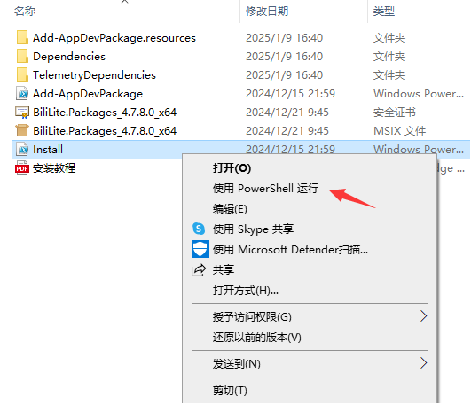
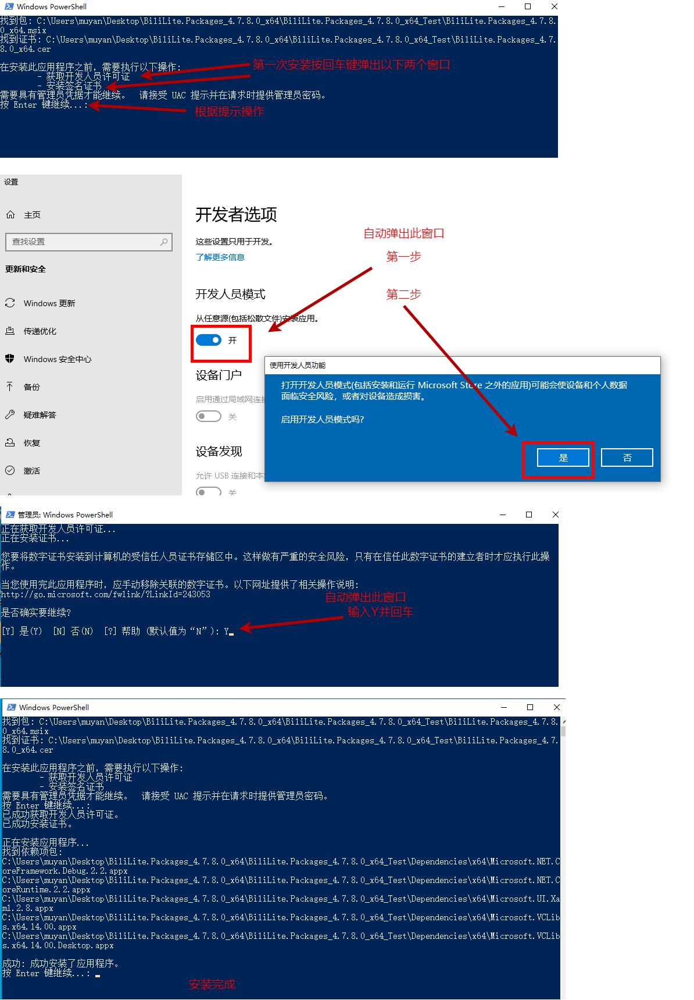
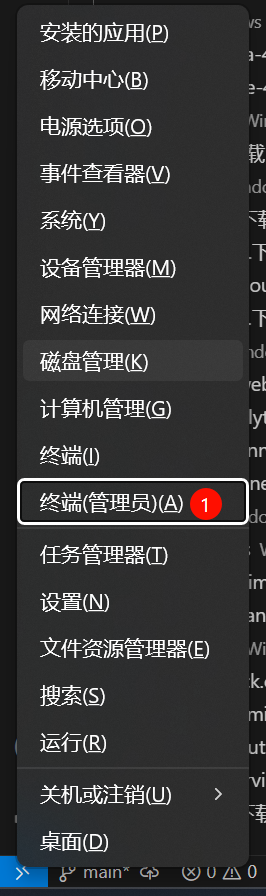

<link rel="stylesheet" href="https://support.microsoft.com/css/glyphs/glyphs.css?v=N9jMfMIoO_s7OATN0j5LYqmO9MCqHDjfpaUV2RuaEy8"/> <!-- <p>先别删这行，在测试显示windowslogo</p> -->
<link rel="stylesheet" href="https://support.microsoft.com/css/fonts/site-fonts.css?v=4M_1wOASateOs9zdphCtIqMvtKo366Gf6pkOjDqzkYo">

# Biliuwp-lite安装教程

- 请从以下方式中任选一种
    - [Chocolatey (推荐，指使用巧克力包管理器安装)](install-readme.md#Chocolatey)
    - [侧载 (指下载安装包手动安装)](install-readme.md#侧载)
- [常见问题](install-readme.md#其他问题)
  - [如何以管理员身份启动终端](install-readme.md#运行安装脚本后终端直接退出)
  - [安装脚本闪退问题](install-readme.md#运行安装脚本后终端直接退出)
  - [网络/代理问题](install-readme.md#网络代理问题)

## 安装要求系统版本信息

- Windows10 2004及以上
- 4.6.x 版本更新 4.7.x， 需要卸载并重启系统后使用脚本方式安装

## Chocolatey

使用巧克力包管理器安装

### 前提

`Chocolatey`(巧克力)是Windows第三方包管理器，使用巧克力安装`Blilite`前需要安装`Chocolatey`， Chocolatey发布地址: [https://github.com/chocolatey/choco/releases](https://github.com/chocolatey/choco/releases)

### 安装

1. 使用管理员身份打开Powershell

2. 使用choco命令

请从以下命令中选择适配自己操作系统架构的命令进行安装(不知道自己操作系统架构可任选，安装程序检测到架构不适配会从Github下载正确的安装包；x64以外的架构未做过测试，使用x86或arm64的用户可以帮忙到讨论区反馈一下)

```sh
# x64架构
choco install bililite-uwp-x64 --pre -y
# x86架构
choco install bililite-uwp-x86 --pre -y
# ARM64架构
choco install bililite-uwp-arm64 --pre -y
```

### 更新

1. 使用管理员身份打开Powershell

2. 使用choco命令

请从以下命令中选择适配自己操作系统架构的命令进行安装(不知道自己操作系统架构可任选，安装程序检测到架构不适配会从Github下载正确的安装包)

```sh
# x64架构
choco upgrade bililite-uwp-x64 --pre -y
# x86架构
choco upgrade bililite-uwp-x86 --pre -y
# ARM64架构
choco upgrade bililite-uwp-arm64 --pre -y
```

### 注意

最新版本发布后由于 Chocolatey 还需要审核(审核需要大约一天)，直接使用install或upgrade命令无法安装或更新到最新版，需要在使用install时指定版本，参考命令如下，请自行将版本号替换当前发布的最新版本

```sh
# x64架构
choco install bililite-uwp-x64 --pre -y  --version=4.7.14-beta
# x86架构
choco install bililite-uwp-x86 --pre -y  --version=4.7.14-beta
# ARM64架构
choco install bililite-uwp-arm64 --pre -y  --version=4.7.14-beta
```

## 侧载

> 请勿直接运行`.msix`安装包进行安装，可能导致奇怪的问题

### 下载安装包

- [https://github.com/ywmoyue/biliuwp-lite/releases](https://github.com/ywmoyue/biliuwp-lite/releases)

### 运行安装脚本

1. 在安装包解压目录中右键单击脚本文件 `.\Install.ps1` ，选择`使用 PowerShell 运行`开始安装



2. 之后根据脚本提示操作即可，如下图所示（仅供参考，Windows不同版本界面可能有差异）



## 其他问题：

### 如何以管理员身份启动终端

1. 点<kbd>Windows</kbd>+<kbd>X</kbd>键并选择以管理员身份启动 终端/PowerShell

### 运行安装脚本后终端直接退出

1. 系统可能无法自动提示启用脚本权限，请根据以下操作启用脚本权限

2. 点<kbd>Windows</kbd>+<kbd>X</kbd>键并选择以管理员身份启动 终端/PowerShell



3. 执行命令 `get-ExecutionPolicy`, 如果输出 `Restricted` 表示 禁止执行脚本,如果输出 `RemoteSigned` 表示 可以执行脚本


4. 执行命令`Set-ExecutionPolicy -ExecutionPolicy RemoteSigned`并按<kbd>Y</kbd>键启用脚本执行权限, 如果执行命令后无任何输出表示执行成功可以进入下一步运行安装脚本

### 网络/代理问题
1. 脚本安装后无法在 Clash For Windows<sup>1</sup> 中解除对此UWP应用的联网限制
   - 可尝试再脚本安装后再使用`.msix`安装包包 Reinstall 一遍（此解决方案仅限 Windows11, WIndows10 未经测试）
   - 如有更好解决方案可[点此前往 Github](https://github.com/ywmoyue/biliuwp-lite/issues/new/choose)提交 issue
  
---
  #### 注1: [Clash For Windows](https://github.com/Z-Siqi/Clash-for-Windows_Chinese) 是一款基于Clash核心的图形界面代理软件，它通过提供一个友好的界面来帮助你简单配置和管理网络代理，让你可以更自由、灵活地浏览全球互联网内容。
